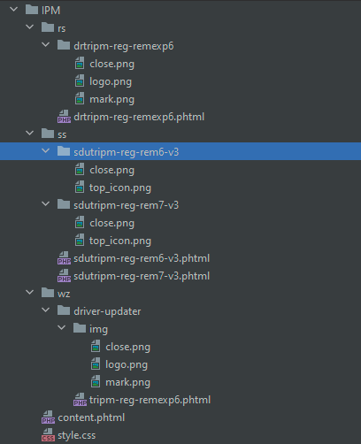

# GULP IPM ASSEMBLER

## Features

- Import PHTML, CSS, img files and watch it.
- Templating for PHTML files

## Tech

Dillinger uses a number of open source projects to work properly:

- [node.js] - evented I/O for the backend
- [Gulp] - the streaming build system

## Installation

git clone https://github.com/AntonKosarev/ipm_assembly.git
npm install

## Development

1) Add your root path and destination build directories in gulpfile/npm.js
2) Exemple of source file structure:


3)	Phtml tamplates:
For including parts into layout with parameters use next command:
```sh
@@include('../content.phtml', {
    "countdown": "<?php include 'templates/timers/48hour-countdown.phtml'; ?>"
})
```
For applicating parameters in the part use next command:
```sh
@@countdown
```